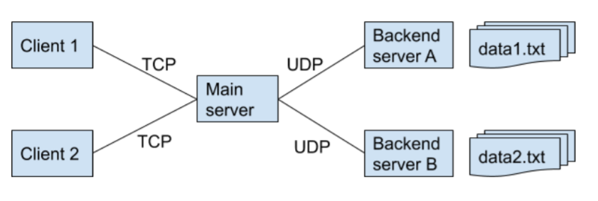
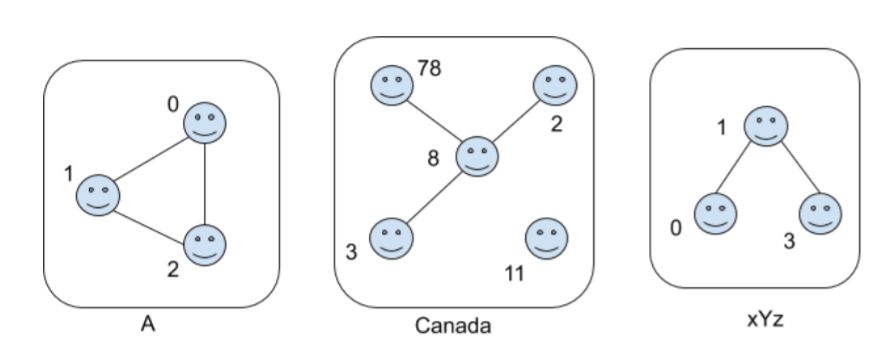

# EE450 Final Project - UNIX Socket Programming
Instructor: [Prof. Ali Zahid](https://viterbi.usc.edu/directory/faculty/Zahid/Ali), Fall 2020, University of Southern California.

## Overview of Socket Project

In this project, I implemented a customized social recommendation system based on STL libraries and TCP/UDP protocols, which contains four major components:
* Bootup
* Query
* Recommendation
* Reply

### Simple Demo

<p align="center"></p>

---

# Client/Server Architecture

There is a total of 5 communication end-points:
* **Client 1 & 2:** Represented two different users, possibly in different countries.
* **Main Server:** Interacted with the clients and the backend servers.
* **Backend Server A & B:** Generated the new friend based on the query.
* **User Data:** Stored as data1.txt and data2.txt in Back-end servers' local file system.

<p align="center"></p>

---

### **Tools & Platforms**
Oracle VirtualBox, Ubuntu VM, Visual Studio Code, Makefile.

---

## **Steps to run the program**
Please clone this repo on your computer (or virtual machine):
```shell
git clone https://github.com/wzy0766/USC-EE450-Computer-Networks.git
cd Project_Files/
```

### Network Booting
For program execution, I used [Makefile](https://www.cs.swarthmore.edu/~newhall/unixhelp/howto_makefiles.html) to automate the compilation and building of programs.

Use the following commands to boot up each server on three separate terminals.
```shell
make all //Compile all files and make them executables
make serverA //Run server A
make serverB   //Run server B
make mainserver  //Run main server
```
Next, use the following commands to boot up client 1 & 2 resepctively on two separate terminals.
```shell
./client   //Run Client 1
./client   //Run Client 2
```
---

## Conclusion

In this project, I constructed a client-server distributed system that included one main server and two corresponding backend servers based on TCP/UDP protocols. The servers can receive users’ queries to obtain new friend recommendations, search through the backend database, generate new friends associate with the query, and reply to users’ requests.

## Further works

As stated in the previous section, the backend server needs to read the text file and convert the social network into graphs --- one graph per country. There are also other ways to represent a graph. In addition to the adjacency matrix/list, I will further implement the Compressed Sparse Row (CSR) format as an alternative method.

# Video Demo

<div align="left">
      <a href="Uploading...">
     
      </a>
    </div>
